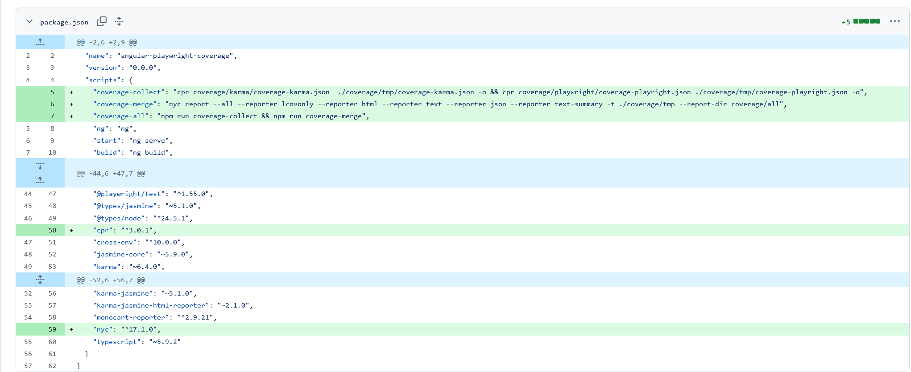

# Angular Playwright Test Coverage

<!-- MACRO{toc} -->

## Intro

This is a step-by-step description of how I currently (2025-09-18) generate Playwright test coverage in Angular projects without Webpack instrumentation.

In the past, I implemented coverage-istanbul-loader instrumentation with Webpack for UI E2E tests.
In the end, I merge the coverage from the Karma tests with the coverage from the Playwright tests (nothing changes there).

My demo project is on GitHub: https://github.com/brabenetz/angular-playwright-coverage
For the Git history, I tried to represent my steps as clearly as possible:

The project starts with "ng-new" and ends with a merged test coverage report (Karma & Playwright), which is published via GitHub Actions.

For further details, you can read the sources:

### Sources

 * Playwright: https://playwright.dev/docs/api/class-coverage (Unfortunately very superficial and theoretical without a working example project)
 * Monocart Reporter: https://www.npmjs.com/package/monocart-reporter
 * Example Project: https://github.com/edumserrano/playwright-adventures/tree/main/demos/code-coverage-with-monocart-reporter

## Instrument Angular App

Nothing to do here! As long as the app provides a source map (e.g., with `ng serve`), the Chrome browser can generate the coverage.

## Optional: test-utils.ts

In my projects, I use a small test-utils.ts implementation:

https://github.com/brabenetz/angular-playwright-coverage/commit/d797c1f8b12b1171076ab118c624619ca0b9f12a#diff-5492cfef1eea58c4dfdff5ef63d244e5321d94baeb49ec03b7b2e6093121985b

1. Creating a screenshot and attaching it to the test report
2. Comparing the current screenshot with a reference screenshot

(i) The comparison with a reference screenshot only works locally (mainly due to different OS fonts), so it's good to only run the comparison if the ENV flag 'SCREENSHOT_VALIDATION=true' is set.  
Nevertheless, the screenshot comparison is useful for every major change or simply for library updates: Generate reference results before the update, and compare the current state with the old screenshots after the update.

## Dependencies and Package Scripts

https://github.com/brabenetz/angular-playwright-coverage/commit/d797c1f8b12b1171076ab118c624619ca0b9f12a#diff-7ae45ad102eab3b6d7e7896acd08c427a9b25b346470d7bc6507b6481575d519 

I always add four scripts to the package.json that I use frequently:

 * **playwright:test-ui**: Starts the Playwright UI. 
 * **playwright:test-ui-with-screenshots**: Starts the Playwright UI with screenshot comparison. In the Playwright UI, screenshot differences are displayed particularly clearly.
 * **playwright:test-all**: Runs the Playwright tests on the console => This is also used by the CI.
 * **playwright:test-update**: To update the reference screenshots => Should be run before every major change.

Then I need two more libraries:

 * `monocart-reporter` The most important one to generate the coverage
 * `cross-env`: Optional, to set the environment variable used in test-utils.ts.

## Adjusting Karma for Coverage

Karma already supports simple configurations for coverage:

https://github.com/brabenetz/angular-playwright-coverage/commit/d00bdfb318d402903014e83957084e7478f36954#diff-25bdb46a5428d318648ec9eb46a99c0268d8c96b672c46e2247a685bc3e384fb

  * In karma.conf.js:
    * The coverage should land in the directory `coverage/karma`.
    * In the reporters, you need to add 'json'. ('lcovonly' is just an example).
  * In package.json: When running the tests, you need to add `--code-coverage=true`.
 

## Adjusting playwright.config.ts

https://github.com/brabenetz/angular-playwright-coverage/commit/d797c1f8b12b1171076ab118c624619ca0b9f12a#diff-f679bf1e58e8dddfc6cff0fa37c8e755c8d2cfc9e6b5dc5520a5800beba59a92

In the Playwright config, the most important thing is to add the `monocart-reporter`.
For merging the coverage data with Karma coverage, you need the 'json' reporter.

The coverage should land in the directory `coverage/playwright`.

## Adjusting the Tests

https://github.com/brabenetz/angular-playwright-coverage/commit/d797c1f8b12b1171076ab118c624619ca0b9f12a#diff-693fac4ef68a358712eaea54434547b7cdd2eca27ce87c64f7943352f4571f74

In the tests, only the import needs to be swapped.
Interesting are the files `tests/_shared/app-fixtures.ts` and `tests/_shared/fixtures/v8-code-coverage.ts` that are used instead.

These two files come from the Monocart Reporter example project: https://github.com/edumserrano/playwright-adventures/blob/main/demos/code-coverage-with-monocart-reporter/tests/_shared/app-fixtures.ts

## Interim Result Testing

After Karma coverage (with `npm run test`) and Playwright coverage (with `npm run playwright:test-all`) have been generated, you should see the reports in the coverage folder:

Important are the JSON files 'coverage-karma.json' & 'coverage-playwright.json': These need to be merged together in the next step.

## Merge Coverage Reports

https://github.com/brabenetz/angular-playwright-coverage/commit/c83d5bb615b985994f0725a86eba5d87425ca4d0#diff-7ae45ad102eab3b6d7e7896acd08c427a9b25b346470d7bc6507b6481575d519

I divide the merge into three scripts:

 * **coverage-collect**: Copies the two JSON files to the directory 'coverage/tmp'
 * **coverage-merge**: Generates reports from the 'coverage/tmp' directory
 * **coverage-all**: Calls coverage-collect && coverage-merge.

Then I need two more libraries:

 * `cpr`: Platform-independent copy command. Supports recursive creation of directories.
 * `nyc`: Standard tool for creating coverage reports.

## GitHub Actions

In the end, you want to see the Playwright reports in the CI after every build.
Using GitHub Actions as an example, it would look like this:

